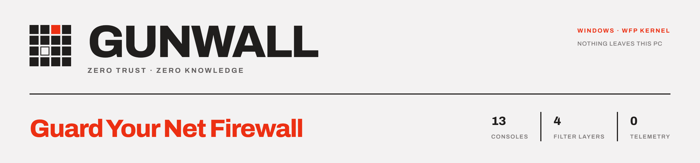

<div align="center">

<picture>
  <source media="(prefers-color-scheme: dark)" srcset="branding/png/banner-hero-dark.png">
  
</picture>

### Know what your PC talks to. Decide who gets through.

A free, open-source **zero-trust firewall for Windows**, built directly on the
Windows Filtering Platform.

[](https://github.com/ox1d3x3/gunwall/releases/latest)
[](https://github.com/ox1d3x3/gunwall/releases)
[](LICENSE)

[](https://www.microsoft.com/windows)
[](https://dotnet.microsoft.com/)
[](#what-gunwall-will-never-do)
[](#project-status)

**[Download](https://github.com/ox1d3x3/gunwall/releases/latest)** ·
**[User Guide](docs/DOCUMENTATION.md)** ·
**[Report a problem](https://github.com/ox1d3x3/gunwall/issues)**

</div>

---

## The problem

Your computer talks to hundreds of servers a day. Some of that is you. Much of it
is not — telemetry, analytics, update checks, software you installed years ago and
forgot about.

Windows allows nearly all of it outbound by default, and shows you almost none of
it.

## What GunWall does

**Nothing reaches the network until you say so.**

Every program is denied by default. When something new tries to connect, GunWall
asks — showing who is asking, where they are going, whether the file is signed, and
which country and company own the other end. You answer once; it remembers.

Then it shows you everything else: live connections, per-application bandwidth, a
world map of where your traffic actually goes, and a searchable log of every
decision with the reason attached.

---

## Why GunWall

|  |  |
|---|---|
| **Kernel-level** | Filters run in the Windows Filtering Platform — the same layer Windows Firewall uses. No proxy, no driver of our own. |
| **Genuinely free** | MIT licensed. No paid tier, no upsell, no features held back for a "pro" version. |
| **Nothing leaves your machine** | No accounts, no telemetry, no analytics. The only outbound requests are ones you ask for. |
| **Readable end to end** | One MIT interface library. Everything that inspects or blocks traffic is the .NET base library plus Win32. |
| **Reversible, provably** | Every way of turning GunWall off returns the machine to Windows defaults — verifiable with Windows' own tools rather than on our word. |
| **Coexists with Windows Firewall** | It does not replace or modify your existing rules. Both apply. |

---

## Features

### 🛡️ Control

- **Zero-trust by default** — every application is approved once, and the choice persists
- **Per-application rules** by direction, with timed and silent variants
- **Custom rules** on address, port, protocol and direction — in your order, first match wins
- **Block by country, continent or network operator**
- **Per-service rules** — stop one Windows service without disturbing others sharing its process
- **Lockdown** to cut everything instantly, **snooze** to pause enforcement for a set period
- **Rule profiles** for home, work and travel

### 👁️ Visibility

- **Live connections** with process, destination, country and network operator
- **Per-application bandwidth**, measured from the kernel when precise metering is on
- **World map** of where your traffic goes
- **Packet log** with the reason for every verdict — including when something *other* than GunWall did the blocking
- **Network scanner** identifying devices by name, likely operating system and gateway role
- **Traffic breakdown** by application, host, protocol and country

### 🔒 Privacy

- **Encrypted DNS** over HTTPS, failing closed rather than silently downgrading
- **Domain blocklists** for ads, trackers and telemetry — with an allow level for entries you disagree with
- **CNAME-cloaking defence**, following alias chains so trackers cannot hide behind a first-party name
- **Per-application domain blocking**, so blocking a tracker cannot disconnect something unrelated on the same server

### ✅ Trust

- **Signature verification** — valid, unsigned and *invalid* are three different things, and GunWall distinguishes them
- **Tamper detection** on applications and on its own filters
- **VirusTotal lookups** with your own key; only a hash ever leaves the machine

<div align="right"><sub><a href="docs/DOCUMENTATION.md">Every feature explained in the User Guide →</a></sub></div>

---

## Install

**[Download the latest release](https://github.com/ox1d3x3/gunwall/releases/latest)**

### 1. Choose your download

| File | For |
|---|---|
| `GunWall-<version>-setup.exe` | **Recommended.** Its uninstaller removes GunWall's kernel filters before deleting anything. |
| `GunWall.exe` | Portable. Right-click → Run as administrator. |

### 2. Run it

Windows SmartScreen will warn you — GunWall is not code-signed, by choice. Choose
**More info → Run anyway**, or verify the published SHA-256 first:

```
certutil -hashfile GunWall.exe SHA256
```

### 3. Watch before you enforce

Leave protection off for a few minutes and open **Connections**. Most people are
surprised by what is already there. When you are ready, turn protection on and
start approving.

> **Requires** Windows 10 (2004+) or Windows 11, 64-bit, with administrator rights.
>
> **Expect prompts for the first ten minutes.** Default-deny means every program
> asks once.

**[Full installation and first-run guide →](docs/DOCUMENTATION.md#2-installing)**

---

## What GunWall will never do

- **No telemetry, analytics, accounts or phoning home.** The only outbound
  requests are ones you ask for: reverse DNS for host names, blocklist downloads,
  and VirusTotal checks if you supply a key.
- **No ads.** Not now, not in a later version.
- **No silent changes.** Every filter corresponds to a button you pressed. A fresh
  install changes nothing until you enable protection.
- **Nothing you cannot undo.** Rules and settings are plain JSON in
  `%ProgramData%\GunWall` — readable, backed up, deletable.

---

## Project status

**GunWall is in public beta and in daily use as a primary firewall.** The filtering
engine, rule evaluation, monitoring, DNS and blocklist subsystems are complete.

Two things to know before relying on it:

- **Filters are persistent.** Closing GunWall, a crash or a reboot does not stop
  them enforcing — that is what a firewall must do. Turning protection off, or
  uninstalling, removes them completely.
- **It runs as a single elevated process.** Service isolation is the last
  architectural item before 1.0.

It has been soak-tested for eleven hours at a stretch without errors, but on a
small number of machines. Your Windows build, VPN and security software are
combinations nobody has tried — which is what a beta is for.

**[Recovery, if anything goes wrong →](docs/DOCUMENTATION.md#16-recovery)**

---

## Roadmap

**In progress** — per-category blocklist controls · IPv6 country coverage · MAC
vendor identification · attributing a kernel drop to the specific filter responsible

**Planned** — WSL and subsystem process identification · tamper *prevention* ·
per-network trust profiles · one-click updates · multi-language interface

**Not planned** — code signing. A certificate is a recurring cost this project will
not pass on or ask for; the published checksum proves more, against source anyone
can read.

**[Full roadmap →](ROADMAP.md)**

---

## Documentation

|  |  |
|---|---|
| **[User Guide](docs/DOCUMENTATION.md)** | Installing, configuring, every screen, troubleshooting |
| [Release notes](docs/RELEASE-NOTES.md) | What is in the current release |
| [Changelog](CHANGELOG.md) | Every change, every version |
| [Architecture](docs/ARCHITECTURE.md) | How the engine works, for developers |
| [Contributing](CONTRIBUTING.md) | Building from source and conventions |
| [Security policy](SECURITY.md) | Reporting a vulnerability |

---

## Contributing

Issues and pull requests are welcome. When reporting a problem, attach a
diagnostics export — **Settings → Export diagnostics (.zip)** — and describe what
you saw rather than what you think caused it.

See [CONTRIBUTING.md](CONTRIBUTING.md) before opening a pull request.

---

## License

[MIT](LICENSE) — use it, fork it, ship it.

**Credits.** GeoIP data from the public-domain [iptoasn](https://iptoasn.com)
dataset, served via
[`jedisct1/iptoasn-webservice`](https://github.com/jedisct1/iptoasn-webservice)
(BSD-2-Clause). Domain blocklist from
[StevenBlack/hosts](https://github.com/StevenBlack/hosts) (MIT). Country flags
from [FlagKit](https://github.com/madebybowtie/FlagKit) (MIT). Interface controls
from [WPF-UI](https://github.com/lepoco/wpfui) (MIT).

---

<div align="center">


**GUNWALL**

<sub>A wall of sixteen stones with three that are not ordinary: one missing, one
stopped in red, one drawn as an outline — a barrier, a block, and something under
watch. Red means blocked, in the mark and in the application.</sub>

<sub>Guard your network. Bismillah.</sub>

</div>
