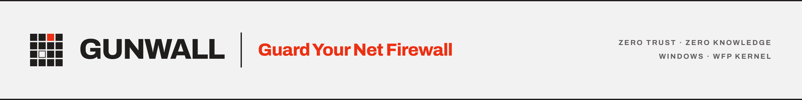

<picture>
  <source media="(prefers-color-scheme: dark)" srcset="branding/png/banner-slim-dark.png">
  
</picture>

# GunWall Roadmap

This document tracks GunWall's path to **full feature parity with mature reference firewalls** on the Windows Filtering Platform, and beyond. It is exhaustive: every capability a complete WFP firewall is expected to have is listed, marked ✅ done, ◐ partial, or ☐ planned.

**Nothing here is tied to a version number.** Work is grouped by what it touches
and how risky it is, not by the release it lands in. Ordering within a group is a
rough sense of value, not a queue — items get picked up when they make sense, and
a version number attached to a plan is a promise about sequencing that this
project has no reason to make. What shipped and when lives in
[`CHANGELOG.md`](CHANGELOG.md); this file is only about what is true now and what
is still open.

GunWall remains **WPF / .NET 8, single elevated portable EXE, zero NuGet dependencies, MIT**. See the "Architecture & language" note at the bottom for why it stays single-language.

---

## ✅ Shipped

**Engine & enforcement** — event-driven WFP detection (kernel net-event stream, not polling) with crash-loop self-recovery · Zero-Trust default-deny with persistent per-app approval · lockdown · stealth mode · per-app allow/block, directional, timed (auto-expiring) and silent (muted) rules · critical-process protection · persistent filters with stored IDs for clean removal.

**Rules** — custom rules by IP / CIDR / port / protocol / direction / local-port · manual IP blocklist · curated system-rule library (~21 presets + secure baseline).

**Threat & privacy blocking** — telemetry & Windows-Update blocklists via hosts file **with automatic WFP firewall-rule fallback** when the hosts file is blocked · ads & trackers via AdGuard DNS · filtering-DNS selection (AdGuard / Quad9) · on-demand online list updates.

**App trust** — **Authenticode signature verification** (valid / unsigned / invalid via WinVerifyTrust) · SHA-256 tamper detection · VirusTotal hash lookup · verified-publisher column and colored signature in alerts.

**Visibility** — connection inspector (TCP+UDP, IPv4+IPv6) with close / block / terminate · live Packets Log (+CSV) · throughput graph · activity feed · LAN network scanner · reverse-DNS host resolution.

**Management & UI** — profiles (import/export) · versioned backups (auto + manual) · Windows Firewall status/on-off/import · diagnostics export · run-at-startup (UAC-skipping scheduled task) · start-minimized · close-to-tray with active-firewall exit warning · configurable alerts (timeout, default action, sound, tray, snooze) · light/dark theme · search bar · always-on-top · update checker.

---

## ☐ Open

### App model & visibility
*Managed C# throughout. No kernel risk.*
- ☑ **UWP / Microsoft Store app support** — Store/UWP apps are detected from their package path, shown with their real display name and a "Store" badge, with package-family identity surfaced in the Properties dialog. They are ruled by executable path (the proven enforcement path), which covers the common case without package-SID interop.
- ✅ **Service & network-app categorization** — connections name the hosted service, and services can be blocked individually by their own identity.
- ◐ **Complete country coverage** — ✅ IPv6 GeoIP, which was the largest gap. Remaining: showing more than the top ten countries on the map, and labelling addresses outside the dataset as *unknown* rather than leaving the cell blank.
- ◐ **Network scan** — ✅ likely OS from reply TTL, gateway identification from the routing table, NetBIOS names where reverse DNS has none, and randomised-MAC detection. Remaining: vendor identification from the MAC OUI, and mDNS names for Apple and IoT devices.

- ☐ **Pico / subsystem process support** — identify WSL and other minimal-process traffic.
- ✅ **App icons in the list** — each executable's icon is shown in the Application column.
- ✅ **App properties dialog** — a per-app detail window (path, publisher, hash, signature, type/package, counts) with **Open file location**, **Copy path** and a notes field.
- ✅ **Purge unused apps** + **keep-unused toggle** + **purge expired timers** — manual purge buttons plus a setting to hide apps with no rule and no live connections.
- ✅ **Protected ("undeletable") rules** — a custom rule can be marked protected; it then refuses deletion until unprotected. (Per-app *disable-notifications* is the existing Mute action.)
- ◐ **Color-highlight customization** — ✅ user-editable colors for signed / unsigned / system / invalid / unknown (Settings → Appearance). Remaining: the **special**, **pico**, **undeletable** and **connection** categories (need the underlying detection).
- ✅ **Per-app notes** — attach a free-text note to any app (in the Properties dialog).

### Notifications, blocklists & logging
*Managed C# throughout. No kernel risk.*
- ✅ **Fullscreen-silent mode** — approval popups are held back while a fullscreen app/game/presentation is foreground (detected via the OS notification-state signal), and appear once it ends.
- ✅ **Confirmation prompts** — confirm-before-clearing the Activity / Packets logs, and an always-confirm-on-exit option (on top of the existing active-firewall exit warning).
- ✅ **Notification exclusions** — alerts are categorised (security, protection changes, network, rules) and each category can be silenced independently. *(GunWall currently raises a single new-app approval prompt, so this waits on having multiple notification categories to exclude.)*
- ◐ **Domain blocking beyond the application layer** — a blocked domain is enforced against the application that requested it, which carries no collateral. Where the process cannot be identified, GunWall falls back to a global address block and withholds it if the address serves anything the user has not blocked. Remaining: a **per-domain override** for forcing the global block deliberately, with the consequences stated.
- ◐ **Blocklist controls** — ✅ an allow level: `@@name` permits a name even when a category or preset blocks it, using the syntax adblock lists already use. Remaining: per-category allow/block/disable in the interface, an additional curated list, and excluding chosen applications from blocklists.
- ✅ **Logging upgrades** *(complete)* — blocked/allowed events to the **Windows Event Log** (toggle), a configurable **log-size limit** (live-row cap + CSV rotation size), and a separate **error log viewer** with deduplicated entries.
- ◐ **View & tray niceties** — ✅ autosize columns, **tray single-click**, and **UI size / zoom**. Remaining: list view modes (details / icon / tile) and icon sizes.

### Kernel hardening
*Touches the WFP filter set. Every item here needs hardware verification and a removal path before it ships.*
- ◐ **Kernel verdict visibility** — ✅ the packet log records what the kernel did, not only what GunWall would have decided, and names a drop caused by other software on the machine. Remaining: attributing that drop to the specific filter responsible.
- ◐ **Expanded WFP layers** — **16 layers wired and verified on hardware**: outbound connect, inbound accept, listen, **resource assignment** (bind, TCP *and* UDP), inbound/outbound transport, outbound ICMP error, and **IP forwarding** — each v4 and v6. Shipped as opt-in, removable rules through the fault-tolerant filter path.
  - ✅ **Kernel layer self-test** — probes every layer *and condition* the kernel accepts, using a permit filter at weight 0 that is non-persistent and deleted immediately. This surfaced three incorrect WFP identifiers that had been failing silently, including one that had disabled IPv4 stealth-mode ICMP suppression entirely.
  - Remaining: ALE_CONNECT_REDIRECT and the matching *_DISCARD* layers (v4/v6).
- ✅ **Quick rule toggles** — *Windows Update* (Delivery Optimization 7680 TCP/UDP, WSUS 8530/8531), *Teredo* (UDP 3544) and *6to4 / ISATAP* (IP protocol 41) as one-tap entries in the system-rule library. Adding 6to4 required the engine to express raw IP protocol numbers: it previously mapped only TCP and UDP and dropped anything else, which would have turned protocol 41 into a permit for every protocol.
- ◐ **Filter tamper resistance** — ✅ detection and self-healing have shipped. Remaining: true prevention via an access-control list, which needs the privilege split first (an elevated-user process cannot lock out other administrators without locking out itself). *Carries a lockout risk; needs a guaranteed recovery path before shipping.* The sublayer-delete-by-key removal path is now proven, which is a prerequisite.

### Advanced and dangerous
*Opt-in, heavily warned, and each one needs a guaranteed recovery path. These are last for a reason, not for a release date.*
- ☐ **Boot-time filters** — enforce blocking during boot before GunWall starts. *Can break boot networking; must be reversible from Safe Mode.*
- ☐ **Windows Update repair (WUFix)** — registry repair for a stuck Update service. *Edits HKLM; gated behind explicit confirmation.*
- ☐ **Compressed / encrypted profile formats** — alongside today's plain JSON.

### Localization
- ◐ **Installation and updates** — ✅ an installer whose uninstaller removes all filtering before deleting anything, keeps the profile across upgrades, and asks before removing it. ✅ the update check resolves the release's installer asset. Remaining: downloading and launching that installer from inside the application.

- ☐ **Multi-language UI** — externalize strings and ship language packs.

---

## 🧭 Architecture & language note

GunWall stays **single-language C# / .NET 8** on purpose. The work a WFP firewall does is dominated by **kernel transitions (WFP filter add/remove, the kernel event stream) and I/O**, not CPU-bound managed code — so rewriting parts in C, Go, or Rust would add cross-language interop, a heavier build, and a larger footprint **without a measurable performance gain**, while breaking the portable single-EXE / zero-dependency goals. The one place native code would matter — a kernel-mode callout driver — is **not used** by mature user-mode WFP firewalls either, and would require driver signing, kernel debugging, and BSOD risk that contradict GunWall being free, portable, and install-free. The right tool here is exactly what's in use.

---

Guard your network. Bismillah.

